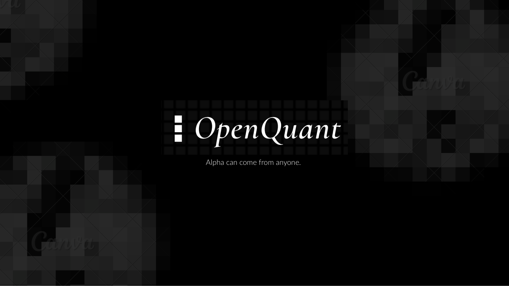
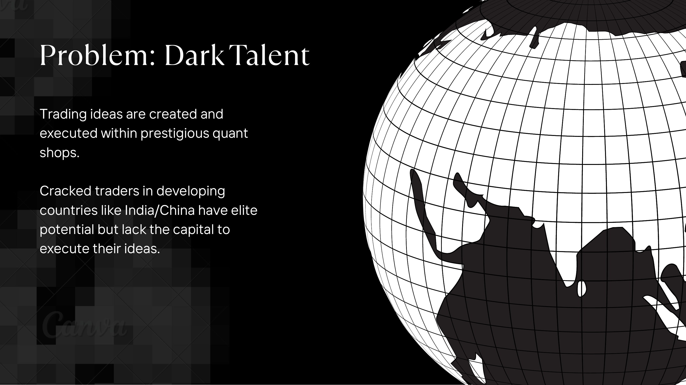
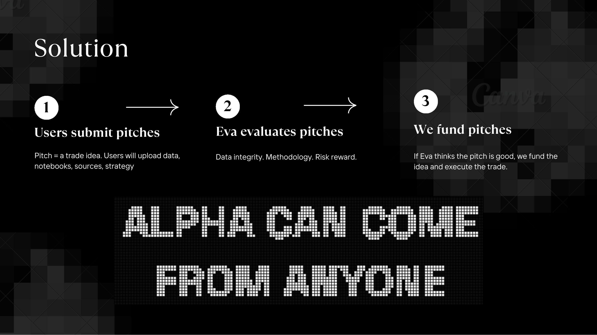
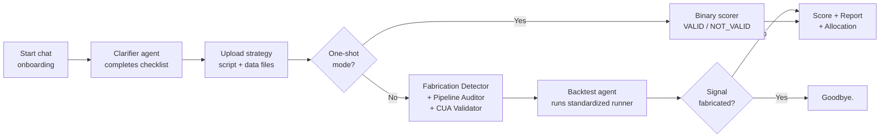

# OpenQuant



High-level overview of the project. For implementation contracts and detailed rules, see [MVP_SPEC.md](MVP_SPEC.md). For a comprehensive discussion of the theoretical foundations, modelling assumptions, and experimental validation, see the [7-Page Thesis](https://drive.google.com/file/d/1EI6PKHE6N8MoWOx-DSY8CaRdBHd87Zzt/view?usp=sharing).

---

## The Problem



Trading ideas are created and executed within prestigious quant shops. Talented traders in developing countries have elite potential but lack the capital to execute their ideas. OpenQuant exists to change that.

---

## The Solution



1. Users submit pitches — a trade idea with data, notebooks, sources, and strategy.
2. Eva evaluates pitches — data integrity, methodology, risk/reward.
3. We fund pitches — if Eva thinks the pitch is good, we fund the idea and execute the trade.

---

## Eva: Agent Swarm


Eva evaluates pitches with 5 specialized agents running in parallel:

- Clarifier Agent (Gemini): Extracts structured fields from pitch submissions.
- Data Provenance Agent (CUA/Claude): Validates uploaded datasets against claimed sources using a Computer Use Agent that navigates and inspects the source pages directly.
- Backtest Agent (Claude): Generates and executes a standardized runner from the user's strategy script, computing all scored metrics automatically.
- Fabrication Detector (Gemini): Detects fake data and manipulated results.
- Methodology Auditor (Gemini): Flags bias, lookahead, and overfitting issues.

---

## User Experience (MVP)



1. User starts chat onboarding.
2. Clarifier agent guides completion of a checklist.
3. User provides thesis, time horizon (`days`, `weeks`, `months`, `years`), stock ticker(s), and source URL(s) when supporting data files are submitted.
4. User uploads files:
   - At least one strategy/signal file is required for evaluation.
   - Preferred for backtest: strategy script (`.py` or `.ipynb`).
   - Supporting CSV/TSV data files are optional.
   - Price CSV uploads are optional and never required — prices are fetched internally via Alpaca during backtesting.
5. Once intake is complete, evaluation auto-runs (chat-style; commands are optional).
6. Before scoring, CUA automatically validates every uploaded data file against submitted source URLs.
7. For non-one-shot pitches, backtest is required before final review submission.
8. For `.py`/`.ipynb` strategy submissions, Fabrication Detector and Pipeline Auditor always run in parallel.
9. For event-driven non-repeatable theses, use `/oneshot on` or include `one_shot_mode=true` in chat.
10. Evaluation outcome:
    - Fabricated/cheating signal → `Goodbye.`
    - Missing/unclear validation aspects → clarification loop and `/evaluate`
    - Clean validation → ready for final review with `Congrats!`
11. User receives score + report + allocation recommendation once ready for final review.

---

## Why this structure

- Keeps onboarding simple for users.
- Preserves minimum standardization for reliable quant evaluation.
- Enforces data provenance when supporting datasets are submitted.
- Makes missing fields explicit and actionable.

---

## Current app status

- Interactive Chainlit app is live.
- Local scoring and reporting are implemented.
- Checklist-style readiness and mandatory gates are implemented.
- FastAPI routes expose read-only pitch history and message logs (`/api/pitches*`), plus a lightweight dashboard (`/dashboard`).
- Reviewer approve/reject workflow is not part of the current MVP surface.
- Some advanced fetcher/auditor integrations remain MVP+ work.

---

## Key docs

| Doc | Purpose |
|---|---|
| [README_CHAINLIT.md](README_CHAINLIT.md) | Product setup and local run |
| [MVP_SPEC.md](MVP_SPEC.md) | Detailed product and engineering spec |
| [chainlit.md](chainlit.md) | Chainlit user-facing instructions |
| [Thesis](https://openquant-thesis.tiiny.site) | Theoretical foundations, modelling, experimental validation |

---

## Quick start

```powershell
python -m venv .venv
.venv\Scripts\Activate.ps1
pip install -r requirements.txt
chainlit run app.py
```

Model configuration is environment-driven:

- App + evaluators read `GEMINI_MODEL` from `.env`.
- CUA fetcher reads `ANTHROPIC_MODEL` from `.env`.
- Backtest agent reads `ANTHROPIC_API_KEY` and `ANTHROPIC_MODEL` from `.env` (same key as CUA, but used directly in-process — no Docker required).
- Paid usage tracking reads:
  - `PAID_API_KEY` (required to send usage signals)
  - `PAID_EVENT_NAME` (optional, defaults to `eva_by_anyquant`)
  - `PAID_EXTERNAL_PRODUCT_ID` (optional, defaults to `quant_pitch_evaluator`)
  - `PAID_EXTERNAL_CUSTOMER_ID` (optional global override)
  - `PAID_USAGE_ENABLED` (`true`/`false`, defaults to enabled when `PAID_API_KEY` is set)

---

## Optional: CUA data fetcher (Docker)

The `cua/` folder contains an optional Computer Use Agent runner based on Anthropic's official `computer-use-demo` image. Use Docker Compose from inside `cua/`:

```powershell
cd cua
docker compose build
docker compose run --rm --remove-orphans data-fetcher "https://www.netflix.com/tudum/top10" "Validate downloaded data against reference file" "reference_user_file.csv"
```

Multiple CUA containers run simultaneously when a pitch has more than one data file — each file gets its own isolated container. Host VNC/noVNC ports are not statically bound, which allows concurrent runs without port conflicts. To watch a specific container's desktop, use `--service-ports` to get dynamically assigned host ports:

```powershell
docker compose run --rm --service-ports data-fetcher ...
# then check `docker ps` for the assigned host port → open http://localhost:<port>
```

Model selection:
- Default is `claude-sonnet-4-6` (recommended for stronger web navigation reliability).
- For cheaper testing, set `ANTHROPIC_MODEL=claude-haiku-4-5-20251001`.
- Tool version is auto-paired in `cua/data_fetcher.py`, or can be overridden with `CUA_TOOL_VERSION`.

CUA fetch behavior:
- The agent is CUA-first in `cua/data_fetcher.py`: it is strongly encouraged to navigate and click in-browser controls.
- Bash/terminal/script fallback (`bash`, `curl`, `wget`, inline Python) is allowed when it is the best practical path.
- The 3rd CLI arg is a reference filename already present in `~/Downloads`; CUA inspects it first, then searches source pages.
- Artifact checks are dynamic (no hardcoded filename/type requirement); matching quality is decided from CUA reasoning + downstream validators.
- After each CUA run, the main agent performs an LLM match review between reference and downloaded candidates.
- If mismatch is detected, the system automatically re-runs CUA with corrective guidance (configurable by `CUA_MAX_ATTEMPTS`, default `3`).

> `docker run build` is not a valid build command. Use `docker compose build` (or `docker build`).

---

## Principles

- Keep user inputs minimal but meaningful.
- Use `strategy_scorer.py` as the canonical scoring system in MVP.
- Prefer clarity and auditability over complexity.

---

## One-shot strategy mode

For single-event strategies (where Sharpe/win-rate are not meaningful), use:

```
/oneshot on
```

Then run `/evaluate`. The system returns a binary recommendation (`VALID` / `NOT_VALID`) and does not assign USD allocation.

Write naturally — no magic keywords required. An LLM extraction agent reads your thesis, supporting notes, and CSV column names/samples to automatically infer the event type, map columns to the right statistical roles, and parse numeric assumptions from free-form text (e.g. "I think there's a 65% chance the deal closes").

Minimum one-shot inputs:

| Node | Applies to | Minimum data |
|---|---|---|
| Node 1 | causal chain | CSV ≥ 30 rows: causal driver series + target asset return |
| Node 2 | all types | CSV ≥ 20 rows: probability estimates (0–1) + binary realized outcomes |
| Node 3 | causal chain | CSV ≥ 8 historical episodes: driver intensity + price change |
| Node 4 | all types | Probability estimate, market-implied probability, upside/downside payoffs — described conversationally in supporting notes |

The event type (causal chain, binary event, or deal spread) is inferred automatically from your thesis. If extraction confidence is low, the system widens uncertainty and asks a clarifying question instead of failing silently.

Event variants:
- causal_chain (default): uses Nodes 1–4 + Monte Carlo.
- binary_event: uses Node 2 + Node 4 + Monte Carlo (skips Nodes 1 and 3).
- deal_spread: uses Node 2 + deal-pricing node + Monte Carlo. Describe the current price, acquisition/break prices, and your close probability conversationally.

Legacy `key=value` format still accepted as a fallback for backward compatibility.

---

## Test scripts

```powershell
# All validator cases
python validator_cases/run_validator_cases.py

# CUA Netflix fetch test (GUI flow with context "click the download button")
python validator_cases/run_cua_tests.py

# Basic direct CUA smoke test (Anthropic path only, bypasses pitch_engine matching)
python validator_cases/run_cua_basic_test.py
```

Optional env overrides for CUA test:

| Variable | Default |
|---|---|
| `CUA_TEST_REFERENCE_FILE` | `2026-02-21_country_weekly.tsv` in repo root |
| `CUA_TEST_NOTES` | `click the download button` |
| `CUA_BASIC_TEST_URL` | `https://www.netflix.com/tudum/top10` |
| `CUA_BASIC_TEST_NOTES` | `click the download button` |
| `CUA_BASIC_TEST_TIMEOUT_SECONDS` | `240` |
